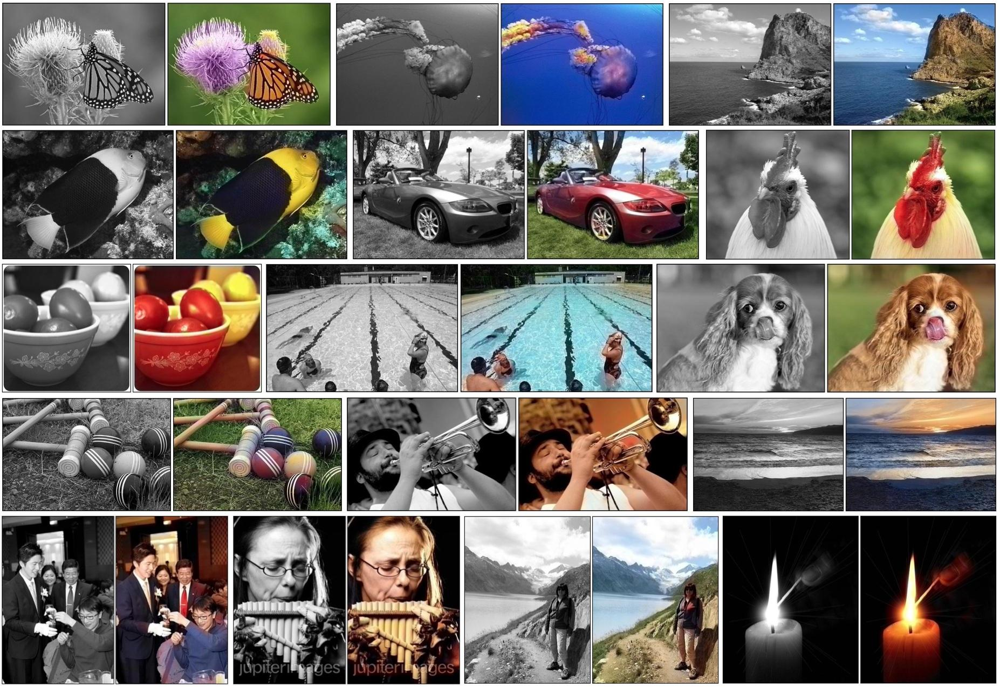
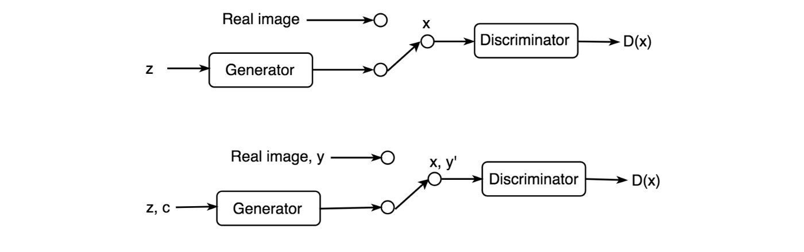
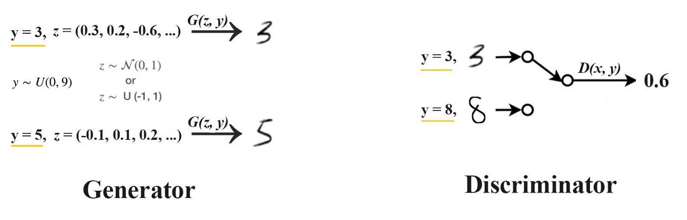
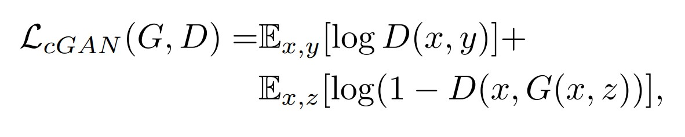
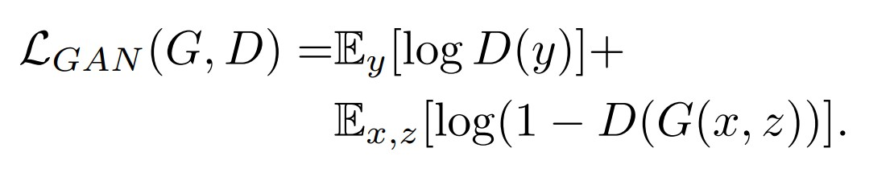
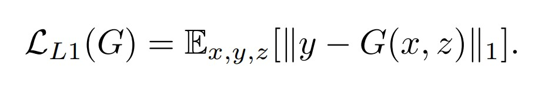
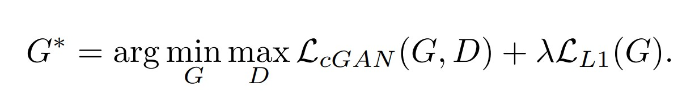
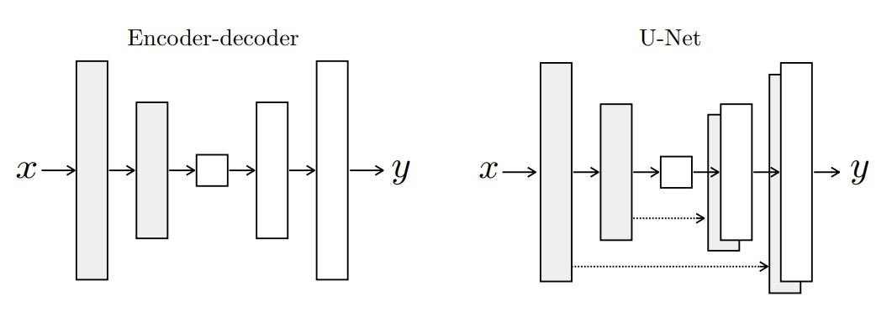

# Image Colorization Using Conditional GANs

## Problem Statement
The task of colourizing black and white photographs necessitates a lot of human input and hardcoding. The goal is to create an end-to-end deep learning pipeline that can automate the task of image colorization by taking a black and white image as input and producing a colourized image as output.

## Solution
* The colorization of grayscale images can be thought of as an image-to-image translation task where we have the corresponding labels for the input grayscale image. A conditional GAN conditioned on grayscale images can be used to generate the corresponding colorized images.
* The architecture of the model consists of a conditional generator with grayscale image inputs and a random noise vector and the output of the generator are two image channels a, b in the LAB image space to be concatenated with the L channel i.e. the grayscale input image.
* This generated image is input to the PatchGAN discriminator which outputs a score for each patch in an input image based on if the patch is real or not. These are used as learning signals for the Generator to generate better images. Along with the generated images, the Discriminator is also fed real images.
* When trained adversarially, the generator should get better at generating realistic colorized images that share a similar structure with the input grayscale images and the discriminator should get better at discriminating between real and fake images.
* The trained generator can then be used for generating colorized images given input grayscale images.

## Approach
This is the implementation of Conditional GANs, to convert images from greyscale to RGB. 

### CGAN
In CGAN (Conditional GAN), labels act as an extension to the latent space z to generate and discriminate images better. The top figure below is the regular GAN and the bottom adds labels to the generator and the discriminator to train both networks better.

In GAN, there is no control over modes of the data to be generated. The conditional GAN changes that by adding the label y as an additional parameter to the generator and hopes that the corresponding images are generated. We also add the labels to the discriminator input to distinguish real images better.

In MNIST, we sample the label y from a uniform distribution to generate a number from 0 to 9. We encode this value into a 1-hot vector. For example, the value 3 will be encoded as (0, 0, 0, 1, 0, 0, 0, 0, 0, 0). We feed the vector and the noise z to the generator to create an image that resembles “3”. For the discriminator, we add the supposed label as a one-hot vector to its input.

#### Objective
The objective of a conditional GAN can be expressed as

where G tries to minimize this objective against an adversarial D that tries to maximize it, i.e. G∗ = arg minG maxD LcGAN (G, D).
To test the importance of conditioning the discriminator, we also compare to an unconditional variant in which the
discriminator does not observe x:

Previous approaches have found it beneficial to mix the GAN objective with a more traditional loss, such as L2 distance [43]. The discriminator’s job remains unchanged, but the generator is tasked to not only fool the discriminator but also to be near the ground  truth output in an L2 sense. We also explore this option, using L1 distance rather than L2 as L1 encourages less blurring:

Our final objective is

Without z, the net could still learn a mapping from x to y, but would produce deterministic outputs, and therefore fail to match any distribution other than a delta function. Past conditional GANs have acknowledged this and provided Gaussian noise z as an input to the generator, in addition to x.

### U-Net Generator
A U-Net architecture allows low-level information to shortcut across the network. The encoder-decoder is created simply by severing the skip connections in the UNet. The encoder-decoder is unable to learn to generate realistic images in our experiments. The advantages of the U-Net appear not to be specific to conditional GANs: when both U-Net and encoder-decoder are trained with an L1 loss, the U-Net again achieves the superior results.

